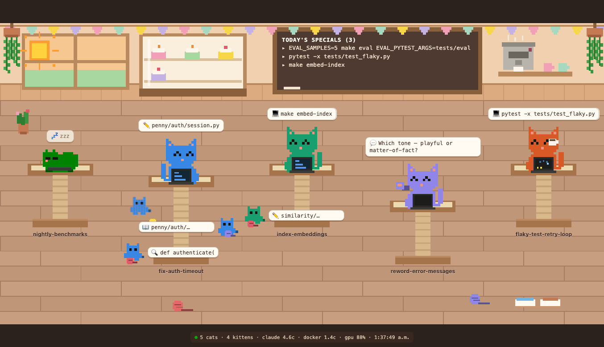

# 🐱 Nekomata

A pixel-art **cat cafe** that visualizes your running [Claude Code](https://claude.com/claude-code)
sessions as cats. Each Claude session is a cat on a tree; its subagents are kittens;
your machine's CPU, GPU, and Docker load are the cafe's window, espresso machine, and
pastry case. It docks in a panel next to your terminals and updates live.

Named for the *nekomata* — the two-tailed cat of Japanese folklore — because a fleet of
agents is a fleet of many-tailed cats.



*Above: a demo scene. From left — a sleeping cat, a working cat with three kittens (two
working with speech bubbles, one chasing yarn), another working cat, a cat raising its
paw with a question, and a cat sipping coffee while it waits on background tasks. Run it
yourself with `python3 fleet_dashboard.py --demo`.*

## What you see

- **Cats** — each top-level Claude Code session, named by its git branch or task, on a
  cat tree. They work (typing at a lit laptop), wait for a task (sipping coffee while a
  spinner turns), raise a paw when they need *you*, doze off when idle, and startle awake
  when you return.
- **Kittens** — each session's subagents, climbing the tree while they work and chasing
  yarn on the floor when they're done. The tree grows taller with more working kittens.
- **The room** — the window's sun tracks host **CPU**, the pastry-case cakes are your
  **Docker** containers, and the espresso machine's activity tracks **GPU** load.
- **The adoption man** — a short fellow who carries new cats in and finished ones out.

Hover any cat or kitten for its full latest activity.

## Requirements

- **macOS** (uses `ioreg`, `lsof`, and `ps` — Linux/Windows aren't supported yet).
- **Python 3** on your `PATH` (macOS ships with it).
- Claude Code, writing transcripts to `~/.claude/projects/` (its default).
- Docker is optional — the pastry case just stays empty without it.

## Install

Grab a `nekomata.vsix` — either from the
[latest build artifact](../../actions) (download `nekomata-vsix`) or a
[release](../../releases) — then install it into your editor:

```bash
code     --install-extension nekomata.vsix   # VS Code
cursor   --install-extension nekomata.vsix   # Cursor
windsurf --install-extension nekomata.vsix   # Windsurf
```

Reload the window, then run **Nekomata: Open** from the command palette (`Cmd+Shift+P`).
Drag the panel next to your terminals if you like — it remembers where you put it.

### No extension? Just open the page

The extension is only a convenience wrapper. The server serves a plain web page, so on
any editor (JetBrains, etc.) or in a browser you can:

```bash
python3 fleet_dashboard.py   # then open http://localhost:8787
```

## Build it yourself

```bash
./build.sh   # copies the server into the extension and packages nekomata.vsix
```

No dependencies to install — the build fetches `@vscode/vsce` on demand. Pushing to
`main` also builds the `.vsix` as a downloadable CI artifact; tagging `v*` attaches it to
a GitHub release.

## Configuration

Settings under `nekomata.*`:

| Setting | Default | Description |
|---|---|---|
| `nekomata.port` | `8787` | Port the server listens on. |
| `nekomata.pythonPath` | `python3` | Python 3 interpreter for the server. |
| `nekomata.serverScript` | *(bundled)* | Override path to `fleet_dashboard.py`. |

## How it works

`fleet_dashboard.py` is a stdlib-only Python server. Three background threads sample
`ps` (process trees under each `claude` process), `docker stats`, and the session
transcript files in `~/.claude/projects/`, then serve a canvas-rendered scene at
`localhost:8787`. The extension is a thin webview wrapper that spawns the server, keeps it
alive, and pushes data into the view from the extension host (which sidesteps the timer
throttling VS Code applies to background webviews).

## License

MIT — see [LICENSE](LICENSE).
