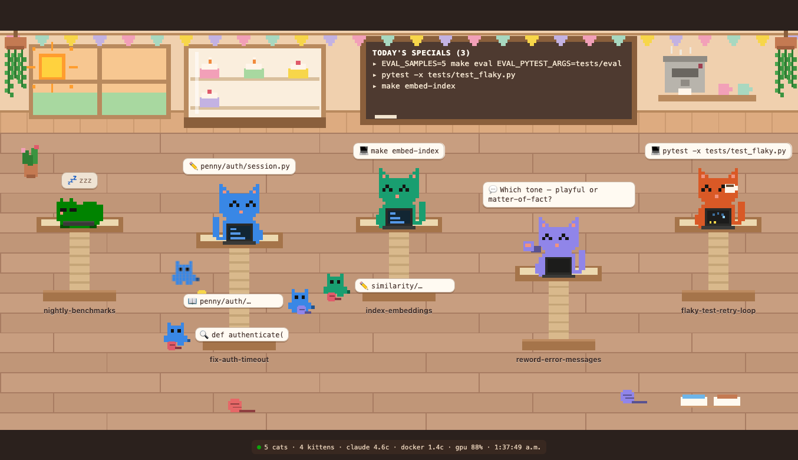
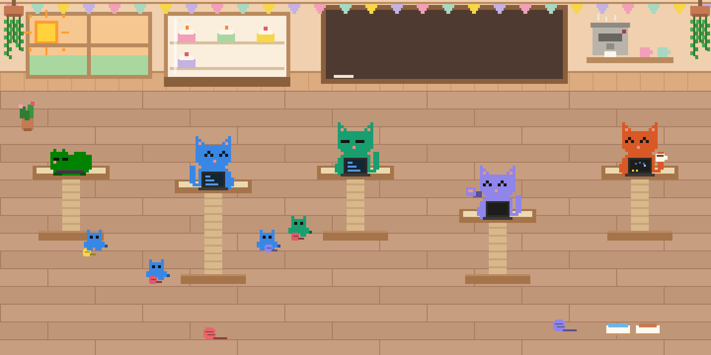
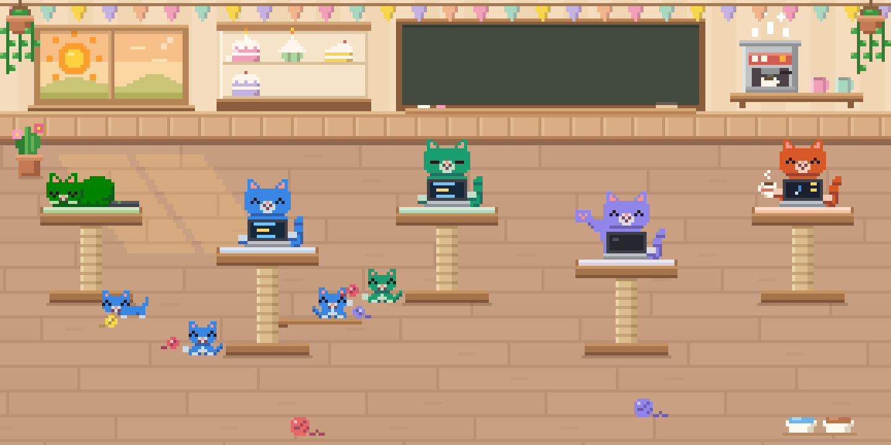
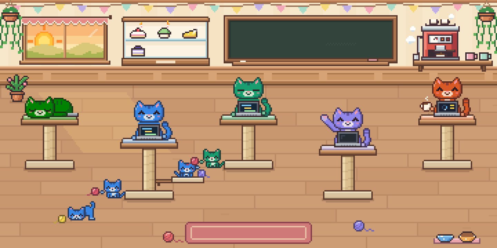

# 🐱 Nekomata

A pixel-art **cat cafe** that visualizes your running [Claude Code](https://claude.com/claude-code)
sessions as cats. Each Claude session is a cat on a tree; its subagents are kittens;
your machine's CPU, GPU, and Docker load are the cafe's window, espresso machine, and
pastry case. It docks in a panel next to your terminals and updates live.

Named for the *nekomata* — the two-tailed cat of Japanese folklore — because a fleet of
agents is a fleet of many-tailed cats.



*Above: a demo scene. From left — a sleeping cat, a working cat with three kittens (two
working with speech bubbles, one chasing yarn), another working cat, a cat raising its
paw with a question, and a cat sipping coffee while it waits on background tasks. Run it
yourself with `python3 fleet_dashboard.py --demo`.*

## What you see

- **Cats** — each top-level Claude Code session, named by its git branch or task, on a
  cat tree. They work (typing at a lit laptop), wait for a task (sipping coffee while a
  spinner turns), raise a paw when they need *you*, doze off when idle, and startle awake
  when you return.
- **Kittens** — each session's subagents, climbing the tree while they work and chasing
  yarn on the floor when they're done. The tree grows taller with more working kittens.
- **The room** — the window's sun tracks host **CPU**, the pastry-case cakes are your
  **Docker** containers, and the espresso machine's activity tracks **GPU** load.
- **The adoption man** — a short fellow who carries new cats in and finished ones out.

Hover any cat or kitten for its full latest activity.

## Art styles

The cafe comes in three art styles. The cats, their states and everything they do are the
same in each; only the drawing changes. Below is the same moment in all three: a sleeping
cat, a working cat with its kittens, another at work, one raising a paw and one on a coffee
break. (These are the scene alone, without the speech bubbles and name labels drawn over it.)

**`8bit`** — the original, and the default: flat, chunky cats on big pixels.



**`16bit`** — a step finer: shaded cats with pale muzzles and happy eyes, and a little more
room detail.



**`32bit`** — the cosiest: round, outlined cats with stripes and blush, in a panelled room
with a rug.



### Seasonal themes

The `32bit` style dresses up for the seasons: **Halloween** (a night window with bats, witch
hats, jack-o'-lanterns), **Christmas** (snow, a tree with presents, Santa hats), **winter**
(snowdrifts, cocoa, a wood stove, knitted beanies), **spring** (blossom, tulips, a flower by
one ear), **summer** (a beach, ice creams, sunglasses) and **autumn** (falling leaves, pies,
scarves). By default the theme follows the date:

| Theme | Dates |
|---|---|
| Winter | January 7 to March 19 |
| Spring | March 20 to May 31 |
| Summer | June 21 to August 31 |
| Autumn | September 22 to November 30, around Halloween |
| Halloween | October 15 to 31 |
| Christmas | December 1 to January 6 |

and the everyday cafe in between. The `nekomata.theme` setting (or `?theme=`, or **Theme** in
Glade) picks one for good, or `none`.

Pick one with the `nekomata.style` setting in your editor, or add `?style=16bit` to the page's
address when you open it yourself. In Glade it is the plugin's **Art style** setting, under
Settings › Plugins.

## Requirements

- **macOS** (uses `ioreg`, `lsof`, and `ps` — Linux/Windows aren't supported yet).
- **Python 3** on your `PATH` (macOS ships with it).
- Claude Code, writing transcripts to `~/.claude/projects/` (its default).
- Sessions from an interactive terminal and from SDK harnesses (Nimbalyst, the
  Agent SDK) are both shown. A terminal session holds a seat while its `claude`
  process lives; a harness session runs one process per turn, so it stays
  seated for the activity window instead of leaving after every reply.
- Docker is optional — the pastry case just stays empty without it.

## Install

Grab a `nekomata.vsix` — either from the
[latest build artifact](../../actions) (download `nekomata-vsix`) or a
[release](../../releases) — then install it into your editor:

```bash
code     --install-extension nekomata.vsix   # VS Code
cursor   --install-extension nekomata.vsix   # Cursor
windsurf --install-extension nekomata.vsix   # Windsurf
```

Reload the window, then run **Nekomata: Open** from the command palette (`Cmd+Shift+P`).
Drag the panel next to your terminals if you like — it remembers where you put it.

### No extension? Just open the page

The extension is only a convenience wrapper. The server serves a plain web page, so on
any editor (JetBrains, etc.) or in a browser you can:

```bash
python3 fleet_dashboard.py   # then open http://localhost:8787
```

## Glade

Nekomata also runs as a plugin in [Glade](https://github.com/lockhart-ai/glade), beside its
terminal. There the cats are Glade's tasks rather than Claude Code sessions, and Glade feeds
them to the page directly, so no server or Python is involved:

- **Cats** are the active tasks in every workspace, **kittens** their subagents. A finished
  kitten chases yarn for a few minutes, then leaves.
- A cat **types** while its task works, **raises a paw** while it asks you a question or
  waits on a permission card, sips **coffee** while it's paused or its background subagents
  run on, and **sleeps** while it waits on you. Tool calls and notes are the speech bubbles.
- Marking a task done (or deleting it) sends the adoption man to carry its cat out.
- The window, the pastry case and the espresso machine follow your Mac's load once you let
  them: Nekomata asks for Glade's `machine` capability, which shows under it in
  **Settings › Plugins** as **Can see your Mac's CPU, GPU and Docker load**, off until you
  turn it on. With it on, Glade sends the CPU cores in use (all, and Claude Code's share),
  the GPU's utilisation and each running Docker container about every 2 seconds, and the sun
  climbs with the CPU, a cake sits in the case per container (steaming while it's busy) and
  the espresso machine brews with the GPU, as on the dashboard. With it off, they stay quiet.

To install it:

```bash
./build.sh glade   # builds the plugin folder in dist/glade/nekomata
cp -R dist/glade/nekomata ~/Library/Application\ Support/glade/plugins/
```

Then open Glade (or **Settings › Plugins**, which rereads the folder) and make sure Nekomata
is turned on there. It shows beside the terminal, with its cat count in the panel header.
Glade runs it sandboxed: one inlined page, with no network and no Node.

## Build it yourself

```bash
./build.sh         # copies the server into the extension and packages nekomata.vsix
./build.sh glade   # builds the Glade plugin folder in dist/glade/nekomata
node --test        # runs the tests (Node 20+, no install)
```

No dependencies to install — the build fetches `@vscode/vsce` on demand. Pushing to
`main` also builds the `.vsix` as a downloadable CI artifact; tagging `v*` attaches it to
a GitHub release.

## Configuration

Settings under `nekomata.*`:

| Setting | Default | Description |
|---|---|---|
| `nekomata.style` | `8bit` | The art style: `8bit`, `16bit` or `32bit`. |
| `nekomata.theme` | `seasonal` | A seasonal theme for the `32bit` style: `seasonal` (by date), `none`, `halloween`, `christmas`, `winter`, `spring`, `summer` or `autumn`. |
| `nekomata.port` | `8787` | Port the server listens on. |
| `nekomata.pythonPath` | `python3` | Python 3 interpreter for the server. |
| `nekomata.serverScript` | *(bundled)* | Override path to `fleet_dashboard.py`. |

## How it works

`fleet_dashboard.py` is a stdlib-only Python server. Three background threads sample
`ps` (process trees under each `claude` process), `docker stats`, and the session
transcript files in `~/.claude/projects/`, then serve a canvas-rendered scene at
`localhost:8787`. The extension is a thin webview wrapper that spawns the server, keeps it
alive, and pushes data into the view from the extension host (which sidesteps the timer
throttling VS Code applies to background webviews).

The page itself is two layers. `web/app.js` decides what happens: who is working, waiting or
asleep, where each cat sits, when the adoption man walks. An art style in `web/art/` draws it:
the room, the cats and everything else, and where each thing goes. `web/art/8bit.js` is the
original look, and its header describes what a style provides; a new file there is a new
style. `node tools/scene-shot.mjs --style <id>` writes frames of a style as PNGs. `node --test` replays a scripted minute and a half in the cafe without a
browser and checks every frame against `test/golden/`, so a change to the scene's behaviour
can't quietly change what a style draws.

## License

MIT — see [LICENSE](LICENSE).
